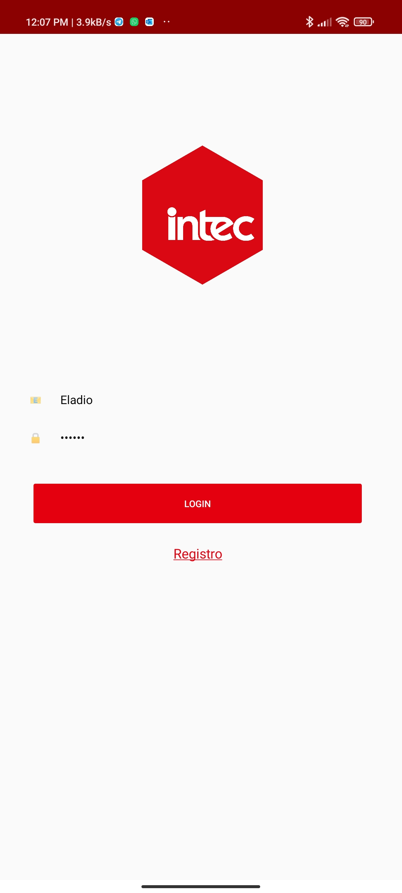
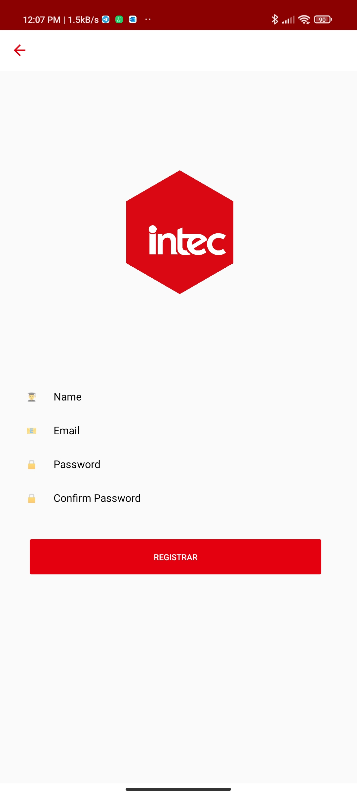
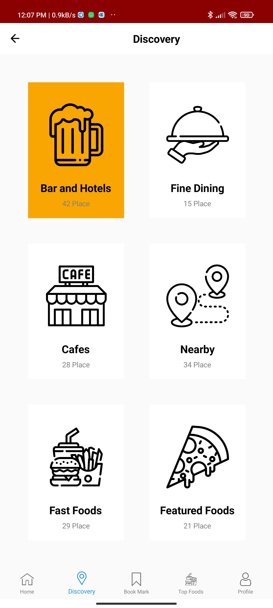

# INTEC APP

Intec App Clone using Xamarin Forms

Web App Reference [procesos.intec.edu.do](https://procesos.intec.edu.do)

## Screenshots / Clone APP

## Tools used

- **Xamarin.Essentials** - Essential cross platform APIs for yout mobile apps.
<https://github.com/xamarin/Essentials>

- **Xamarin.Forms** - Build native UIs for iOS, ANdroid, UWP, macOS, Tizen and manu more from a single, shared C# codebase.
<https://github.com/xamarin/Xamarin.Forms>

- **Xamarin.CommunityToolkit** - The Xamarin Community Toolkit is a collection of Animations, Behaviors, Converters, and Effects for mobile development with Xamarin.Forms. It simplifies and demonstrates common developer tasks building iOS, Android, and UWP apps with Xamarin.Forms.
<https://github.com/xamarin/XamarinCommunityToolkit>